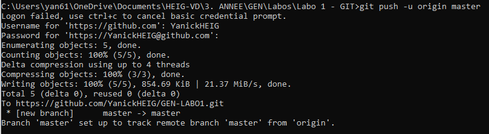

# GEN - Labo 1 - GIT

## 1. Initialisation du repository en ligne de commande

`git init`
`git add .`
`git commit`

On créé ensuite le repo sur GitHub.

_New repo_ -> Name repo

On obtient maintenant un lien vers lequel on peut synchroniser notre repo local

`git remote add origin https://github.com/YanickHEIG/GEN-LABO1.git`
`git push -u origin master`

On a ajouté une image au git, on peut donc refaire un commit/push

`git commit -m "Second commit"`
`git push`

On créé ensuite une nouvelle branche _essai_

`git checkout -b essai`
`git add FirstEssaiCommit.txt`
`git commit -m "First commit on fork 'essai'"
git push --set-upstream origin essai`

`checkout -b` make a fork